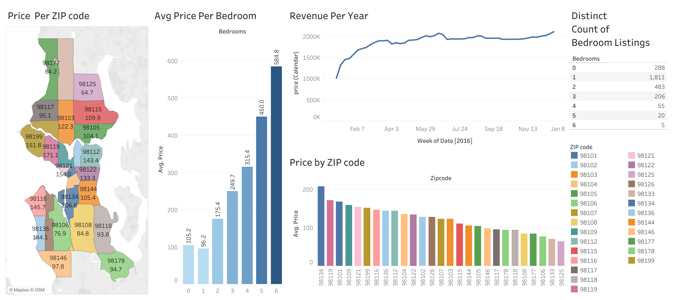

# Airbnb-Price-Analysis-Dashboard

## Overview
This GitHub repository features an interactive dashboard analysing Airbnb home listings in Seattle, Washington. Using a comprehensive dataset, the dashboard offers valuable insights into how listing prices vary based on bedroom count and geographic location. This analysis can assist potential investors in making informed decisions about where and what to invest in within the region.

## Dashboard

This dashboard comprises five key visualisations, each carefully designed to offer specific insights into the pricing and market trends of Airbnb home listings in Seattle:

### Average Price Per Bedroom
This bar chart illustrates the average price for Airbnb listings categorized by the number of bedrooms, ranging from studios (0 bedrooms) to larger homes with up to 6 bedrooms. Interestingly, the chart shows that studios command a slightly higher price compared to one-bedroom apartments, possibly due to factors such as location desirability or premium pricing for smaller, more centrally located units ideal for solo travelers or couples. The chart generally demonstrates increasing prices with additional bedrooms, helping investors identify which property types might offer better returns.

### Price Per ZIP Code
The pricing across different Seattle ZIP codes is captured through two distinct visualisations:
- **Map Visualisation:** A colour-coded geographical map displaying average prices per ZIP code, which enhances the visual comprehension of price disparities across various neighbourhoods to help investors identify high-value areas and those with potential for growth.
- **Bar Chart:** This bar chart ranks Seattle ZIP codes by average listing price, facilitating a direct comparison of values across areas and aiding investors in pinpointing locations with the best potential for investment.

### Revenue Per Year
A line graph tracks weekly revenue, highlighting fluctuations driven by seasonal trends or economic conditions, making this visualisation important for investors aiming to identify the best times to capitalise on rental income.

### Distinct Count of Bedroom Listings
This table shows how many listings are available based on the number of bedrooms, giving a clear view of the market's supply, to help investors see which types of properties are common or rare, guiding their decisions.

## Data Description
The data underpinning these visualisations is contained in the [data file](./Airbnb%20data.xlsx), which includes several detailed worksheets:
- **Price and Bedroom Data:** Lists average prices sorted by the number of bedrooms, elucidating how prices increase with larger properties and suggesting the potential return on investment.
- **ZIP Code Pricing Data:** Features average prices per ZIP code along with geographic coordinates for map integration, crucial for assessing property values across Seattle.
- **Bedroom Listing Counts:** Delivers a detailed count of listings per bedroom category, critical for understanding market supply and demand.
- **Miscellaneous Information:** Various information about reviews, amenities, property type, etc., that were not used in this dashboard.

## Analytical Insights and Utility
Key insights from the dashboard include:
- A direct correlation between the number of bedrooms and listing prices, indicating higher values for larger Airbnb homes and potential higher returns on investment except for studios.
- Significant geographic variations in listing prices, highlighting the importance of location in property valuation and investment choices.
- Seasonal and weekly revenue trends that can guide strategic listing and pricing decisions, optimising investment returns.
- Insights into the availability of listings, which is pivotal for market analysis and strategic investment planning by Airbnb hosts and real estate investors.

## Insights from Airbnb Listing Dashboard

### 1. **Price Distribution by ZIP Code**:
   - The map shows that ZIP codes in the central areas (e.g., 98134, 98119, 98101) have higher average prices compared to more peripheral areas.
   - ZIP codes like 98134 and 98119 have the highest average prices (around $206.6 and $171.1 respectively), indicating these are likely premium areas.

### 2. **Average Price Per Bedroom**:
   - The bar graph demonstrates a clear trend where the average price increases significantly with the number of bedrooms. For instance, a 6-bedroom listing averages around $548 per night compared to $105 for a studio apartment.
   - This indicates that larger properties fetch a higher price, likely reflecting their capacity to accommodate more guests and potentially offer more luxurious amenities.

### 3. **Revenue Per Year**:
   - The line graph shows relatively stable revenue throughout the year, with slight increases during certain weeks. This suggests consistent demand with peaks that could correlate with local events or seasonal tourism trends.

### 4. **Distinct Count of Bedroom Listings**:
   - Listings with 1 bedroom are most common, followed by 2 bedrooms and studios. This distribution suggests that smaller properties dominate the market, which could be due to higher demand for such accommodations or simply more availability of smaller units.
   - Fewer listings are available with more than 4 bedrooms, which might reflect limited market supply or lesser demand for very large accommodations.

### 5. **Price Comparison Across ZIP Codes (Bar Graph)**:
   - The bar graph showing price by ZIP code underlines the price variation across different areas, corroborating the map data. It provides a quick comparative view that can be used for assessing where to invest or where to look for value accommodations.

These insights would be valuable for stakeholders such as potential investors, property owners, and market analysts looking to understand pricing dynamics, market demand, and revenue trends in the Airbnb market in Seattle.
